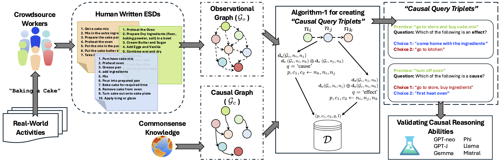

# COLD: Causal reasOning in cLosed Daily activities
[](https://creativecommons.org/licenses/by-nc/4.0/)
[](https://www.cse.iitk.ac.in/users/ajoshi/COLD/) <!-- temporary webpage link  -->
<!-- [](https://exploration-lab.github.io/COLD/)  -->
<!-- official webpage link  (to be updated) -->
<!-- [](https://github.com/Exploration-Lab/COLD) -->

**Picture:** *The proposed COLD framework for evaluating LLMs for causal reasoning. The humanwritten Event Sequence Descriptions (ESDs) are obtained from crowdsource workers and include a
telegrammic-style sequence of events when performing an activity. The Observational Graph and the
Causal Graph for an activity are used to create causal query triplets (details in Algorithm 1), shown
towards the right. Using counterfactual reasoning, “going to the kitchen” is possible without going to
the market (if the ingredients are already available), making “come home with the ingredients.” a
more plausible effect among the given choices. Similarly, in the second example, the event “going to
market” has no direct relation with the event “heating the oven”.*


This repository contains the official release of the following paper:
> **COLD: Causal reasOning in cLosed Daily activities**<br>

> **Authors:** Abhinav Joshi, Areeb Ahmad, and Ashutosh Modi <br>
>
> **Abstract:** *Large Language Models (LLMs) have shown state-of-the-art performance in a variety of tasks, including arithmetic and reasoning; however, to gauge the intellectual
capabilities of LLMs, causal reasoning has become a reliable proxy for validating
a general understanding of the mechanics and intricacies of the world similar to humans. Previous works in natural language processing (NLP) have either focused on
open-ended causal reasoning via causal commonsense reasoning (CCR) or framed
a symbolic representation-based question answering for theoretically backed-up
analysis via a causal inference engine. The former adds an advantage of real-world
grounding but lacks theoretically backed-up analysis/validation, whereas the latter
is far from real-world grounding. In this work, we bridge this gap by proposing the
COLD (Causal reasOning in cLosed Daily activities) framework, which is built
upon human understanding of daily real-world activities to reason about the causal
nature of events. We show that the proposed framework facilitates the creation
of enormous causal queries (∼ 9 million) and comes close to the mini-turing test,
simulating causal reasoning to evaluate the understanding of a daily real-world
task. We evaluate multiple LLMs on the created causal queries and find that causal
reasoning is challenging even for activities trivial to humans. We further explore
(the causal reasoning abilities of LLMs) using the backdoor criterion to determine
the causal strength between events.*


## License
[](https://creativecommons.org/licenses/by-nc/4.0/)
The COLD follows [CC-BY-NC](CC-BY-NC) license. Thus, users can share and adapt the dataset/codebase if they give credit to the authors and do not use the dataset/codebase for any commercial purposes.


## Citation

[**COLD: Causal reasOning in cLosed Daily activities**](https://nips.cc/virtual/2024/poster/96459), 2024. In the Thirty-eighth Annual Conference on [Neural Information Processing Systems (NeurIPS’24)](https://neurips.cc/), Vancouver, Canada.
```
@misc{cold,
      title={COLD: Causal reasOning in cLosed Daily activities}, 
      author={Abhinav Joshi and Areeb Ahmad and Ashutosh Modi},
      year={2024},
      eprint={2411.19500},
      archivePrefix={arXiv},
      primaryClass={cs.CL},
      url={https://arxiv.org/abs/2411.19500}, 
}
```
```
@inproceedings{
       joshi2024cold,
       title={{COLD}: Causal reasOning in cLosed Daily activities},
       author={Abhinav Joshi and Areeb Ahmad and Ashutosh Modi},
       booktitle={The Thirty-eighth Annual Conference on Neural Information Processing Systems},
       year={2024},
       url={https://openreview.net/forum?id=7Mo1NOosNT}
}
```